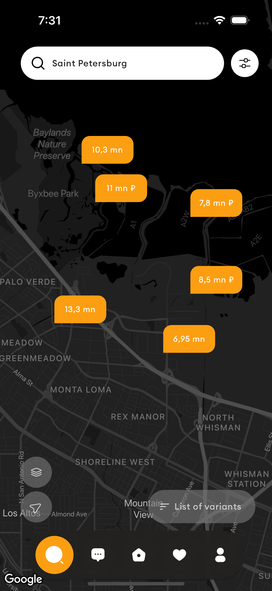

<div align="center">
   

## Moniepoint Assessment

<strong> A take-home assessment from the TeamApt Inc. </strong>

<br/>
[Dribbble link](https://dribbble.com/shots/23780608-Real-Estate-App) <br/>
[Get APK here](https://drive.google.com/drive/folders/19rPMzMpCHUe5Tllrf6ZFekBKlLw468Sh?usp=drive_link)

<sub>Built by <a href="https://twitter.com/_Captured_Heart">Nkpozi Marcel Kelechi</a></sub>
<br />

## AN INTRO VIDEO OF THE APP


https://github.com/Captured-Heart/moniepoint_assessment_marcel/assets/69226443/d33b1af3-3300-4695-bb76-5b8aa1fd36f8


</div>

---

## Getting Started

After cloning,

### FVM setup

it runs on flutter version: flutter: ">=3.22.0", dart: ">=3.3.4 <4.0.0",

Install `fvm` if not already installed.

```bash
dart pub global activate fvm
```

Install the local `flutter` version.

```bash
fvm install
```

---

# Key Features

1. Google Maps:

   - Arranging markers on the map to show the location of the user.
   - Added a dark mode skin to the Google map

2. Flutter Animations:

   - Animated widgets according to the design on Dribbble. [Dribble link](https://dribbble.com/shots/23780608-Real-Estate-App)   

## UI Shots

<div style="text-align: center">
  <table>
    <tr>
      <td style="text-align: center">
        
      </td>
      <td style="text-align: center">
        
      </td>
    </tr>
  </table>
</div>

## Tools

- [google_maps_flutter](https://pub.dev/packages/google_sign_in): A Flutter plugin that provides a Google Maps widget.
- [SVG_Repo](https://www.svgrepo.com/vectors/shield/): Free Shield SVG Vectors and Icons. Shield icons and vector packs for Sketch, Figma, websites or apps. Browse 50 vector icons about Shield term.
- [animated_flip_counter](https://pub.dev/packages/animated_flip_counter):An implicit animation widget that flips from one number to another.
- [auto_size_text](https://pub.dev/packages/auto_size_text): Flutter widget that automatically resizes text to fit perfectly within its bounds.
- [flutter_animate](https://pub.dev/packages/flutter_animate):A performant library that makes it simple to add almost any kind of animated effect in Flutter.
- [flutter_svg](https://pub.dev/packages/flutter_svg):Draw SVG files using Flutter.

